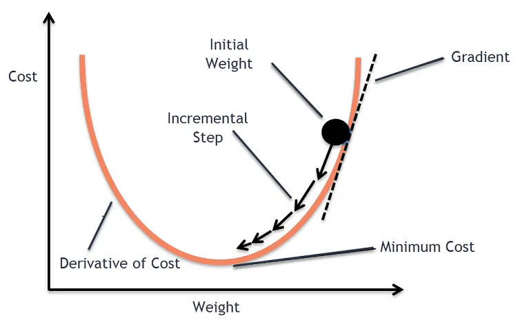

# Linear Regression Notes

Personal notes while studying linear regression, OLS, normal equation and gradient descent.

Focus: intuition + mathematical formulation.

**(noun) Statistics -** a measure of the relation between the mean value of one variable (e.g. output) and corresponding values of other variables (e.g. time and cost).

linear regression :

if we assume time spent studying helps in getting good marks in test, we can try to derive a relationship between these

time spent being the predictor, marks being the output

if we take different samples, say many students in the class and plot the graph of time vs marks, then we try to fit a line or curve so that the line covers almost all points

it is not possible in real life scenario for a line to cover all the points

so what do we do? the best approach is to find the equation for the line which is as near to most points as possible ( zero distance equals the line passes through the point)

the distance we can use between the line and the observation point could be Euclidean distance

a simple linear regression equation is of the form, y = mx + b (in algebraic term)

in ML, it is represented as y’ = b’ + w’x
where b’ and w’ are predicted bias and weight

if the predictors are more than one, then it becomes multiple linear regression and is of the form,

y’ = b’ + w1’x1 + w2’x2 + … + wp’xp

the Euclidean distance mentioned above is called as loss function. because it calculates how far is the actual observation from the point in line. 

loss function can be just the absolute difference (L1) , square of the difference (L2), MSE, RMSE

since MSE has heavy penalty for the larger distances, choosing MSE as a loss function will try to move the line more closer to the outliers. Tries to reduce the bigger mistakes

MAE would avoid that, and will be closer to most of the points

How to find the right bias and weight so that the loss function is minimum?

There are different methods. The most common ones are -

ordinary least squares (OLS), Normal equation, gradient descent, QR / SVD. 

Ordinary least squares method

assumptions are that there is no high correlation between the independent variables
normal distribution with zero mean and constant variation 

derivation of the scalar formula - https://www.analyticsvidhya.com/blog/2023/01/a-comprehensive-guide-to-ols-regression-part-1/

the derivation starts with finding the partial derivative of the loss function MSE wrt the predictors
and then finding the coefficients  

$$
\hat{\beta}_1 = \frac{\sum_{i=1}^{n} (x_i - \bar{x})(y_i - \bar{y})}{\sum_{i=1}^{n} (x_i - \bar{x})^2}
$$

$$
\hat{\beta}_0 = \bar{y} - \hat{\beta}_1\bar{x}
$$

Evaluation OLS models -

residuals vs. fitted values plot, which checks for patterns that might indicate non-linearity or heteroscedasticity

or the Q-Q plot, which examines whether residuals follow a distribution like a normal distribution

R^2, adjusted R^2, F statistic, p value

cross validation

Advanced methods of finding the coeff estimates - 
maximum likelihood - finding the coeff such that the prob of observing the outcomes are maximum
weighted average - coeff can be thought of as weighted averages of the data, and is found out by the variance of predictors and structure of the model

Normal equation

This is the matrix equivalent of the above scalar formula

$$
y = X\theta + \epsilon
$$

$$
\hat{\theta} = (X^TX)^{-1}X^Ty
$$

source - https://www.datacamp.com/tutorial/tutorial-normal-equation-for-linear-regression

https://www.datacamp.com/tutorial/ols-regression

However, solving the normal equation can become computationally demanding, especially with large datasets. To address this, another technique called [**QR decomposition**](https://www.datacamp.com/tutorial/qr-decomposition) is often used. QR decomposition breaks down the matrix of independent variables into two simpler matrices: an orthogonal matrix (Q) and an upper triangular matrix (R). This simplification makes the calculations more efficient and it also improves numerical stability.

Gradient descent

ever used analog radio, where you need to fine tune to a particular radio channel, turning the knobs?

gradient descent works similar way, finding the coeff for which the cost function is minimum, by repeating the task for many iterations

image source for the weight vs cost function: https://www.analyticsvidhya.com/blog/2020/10/how-does-the-gradient-descent-algorithm-work-in-machine-learning/

slope of the curve at given point is obtained by calculating the first order derivate of the curve at given point on the curve

gradient descent starts with the bias and weights set to random numbers or zero
then cost (loss function) is calculated by applying current values of weights and bias to the first order derivative
further, the new weights and bias are calculated / moved in the opposite direction of the tangent (slope)
the weights are moved and adjusted by a fixed proportion / alpha (called as learning rate)
repeat process until the cost is minimum / convergence

Calculate the derivative for the MSE formula - 

$$
J(w, b) = \frac{1}{n} \sum_{i=1}^{n} (y_i - \hat{y}_i)^2
$$

$$
\frac{\partial J}{\partial w} = -\frac{2}{n} \sum_{i=1}^{n} (y_i - \hat{y}_i)x_i
$$

$$
\frac{\partial J}{\partial b} = -\frac{2}{n} \sum_{i=1}^{n} (y_i - \hat{y}_i)
$$

If we graphed the weights and bias points during gradient descent, the points would look like a ball rolling down a hill, finally stopping at the point where there's no more downward slope.

Iterations vs Loss curve - it would decline steeply in the initial iterations and then gradually flatten

There is slight difference in the loss and cost function - loss function is the difference of a single point, cost function is the avg error

source: https://developers.google.com/machine-learning/crash-course/linear-regression

Hyperparameters - 

the params that control the training of the model. Most common hyperparameters are batch size, epochs, learning rate

- batch size : number of observations the model examines before changing the weights and bias

batch - compute the gradient for the entire dataset. high computation

stochastic - compute the gradient for each example. will be noisy, but computationally feasible

mini batch - mix of the above 2. 

- learning rate : also called as alpha, which is multiplied with the gradient to calculate the new weight

it should be not too less (will take forever to converge), not too high (will never converge. loss curve fluctuates widely)

- epoch : when the model has been trained through all observations once, it is called an epoch

Qn - then would not be a single epoch with mini batch be enough to reach the minimal cost function?
Ans - No. because there could be local minimas. Also the learning rate is smaller. Hence the global minima would not have reached with just a single epoch ( single set of parsing through the training dataset)

Difference bw normal equation and gradient descent

source : https://www.datacamp.com/tutorial/tutorial-normal-equation-for-linear-regression

Normal equation is analytical and the result is obtained directly. Gradient descent has the learning period until it converges to the coefficients. 

Also, feature scaling is not required when we use the normal equation approach; we typically perform feature scaling to ensure our features have a similar range of values. 

Failing to normalize our features when we use gradient descent may introduce skewness into the contour plot of the loss function. Since higher the slope, higher will be the delta for the new weight

Higher slope → larger update

Different feature scales → uneven slopes

Uneven slopes → skewed contours → slow convergence

normal equation requires the (X.T * X)^-1 matrix multiplication. For huge number of features, this becomes computational challenge. It is recommended to use gradient descent when the number of features are more than 10,000. 

XT (n,m)
X (m,n) 
X.T X (n,n)
This inversion is depends on the n (number of features). time complexity of O(n^3)

References list - 

- https://developers.google.com/machine-learning/crash-course/linear-regression
- https://www.datacamp.com/tutorial/tutorial-normal-equation-for-linear-regression
- https://www.datacamp.com/tutorial/ols-regression
- https://www.analyticsvidhya.com/blog/2023/01/a-comprehensive-guide-to-ols-regression-part-1/
- https://www.analyticsvidhya.com/blog/2020/10/how-does-the-gradient-descent-algorithm-work-in-machine-learning/